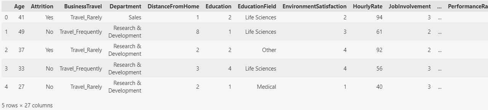
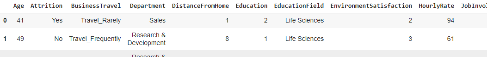
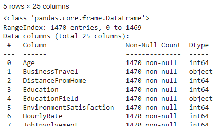
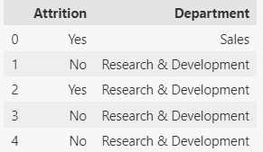
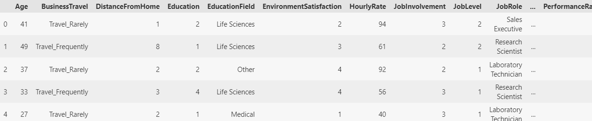
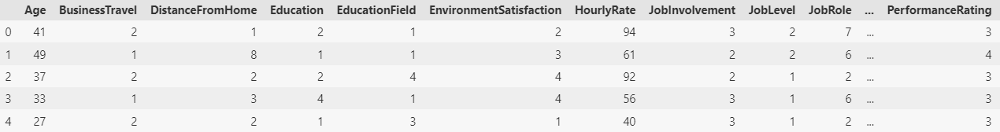
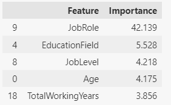
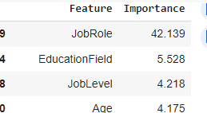

# Employee Attrition Analysis

This project aims to predict employee attrition using various machine learning models, including deep learning, based on features like department, salary, and personal attributes.

The analysis focuses on preprocessing the data, building predictive models, and determining the key factors influencing employee attrition.

**[Project Workflow](#project-workflow)** | **[Modeling](#modeling)** | **[Interpretation and Insights](#interpretation-and-insights)** | **[Follow-On Studies](#follow-on-studies)**

---

## Abstract

This project seeks to understand and predict employee attrition by leveraging machine learning models, specifically deep learning. The dataset is preprocessed using techniques like scaling and encoding, followed by model training and evaluation to identify key drivers of employee turnover.

---

## Core Technologies, Tools

* **Languages/Tools:** Python, Jupyter Notebook
* **Libraries:** scikit-learn, pandas, NumPy, TensorFlow, Keras
* **Algorithms:** Random Forest Classifier, Deep Learning (Neural Networks)
* **Technologies:** Machine Learning, Classification, Data Preprocessing

---

## Project Workflow

#### **Data Collection**

* The dataset was sourced from an online CSV file containing employee information, such as department, salary, and attrition status.



<figure>
    <figcaption><em>fig 1.</em></figcaption>
    
</figure>

<figure>
    <figcaption><em>fig 2.</em></figcaption>
    
</figure>

#### **Pre-Processing**

* Import the data, inspect, determine number of unique values in each column.
* Split data: create two target columns,  `y_df`  using Attrition and Department columns.



#### **Feature Transformation**

* **Ordinal encoding** for categorical features in the y target columns, including Attrition and Department **(fig 3).**


* ****Ordinal encoding** for categorical features in the X feature data:





* **Pandas one-hot-encoder**  `pd.get_dummies()` used to encode remaining X data that was in string format ('JobRole','EducationField','OverTime').

**Data Scaling:** StandardScaler was applied to ensure all numerical features were on the same scale.

    **Exploratory Data Analysis (EDA)**

* Create a Random Forest Classifier to capture and investigate **Data Importance** in X Feature data **(fig 4a, 4b).**



<figure>
    <figcaption><em>fig 4a.</em></figcaption>
    
</figure>

<figure>
    <figcaption><em>fig 4b.</em></figcaption>
    
</figure>

**Correlation Analysis:** Assessed relationships between features to determine variables most correlated with attrition; plotted Correlation Matrix **(fig 5).

Could consider dropping 2 of the following (*although > 90% is a more typical threshold to use):*

* YearsAtCompany (4 over 60%)
* TotalWorkingYears (3 over 60%)
* YearsWithCurrentManager (2 over 60%)
* YearsInCurrentRole (2 over 60%)

`<figure>`
    `<figcaption><em>`fig 5.`</em></figcaption>`
    `</figure>`

---

## Modeling

#### **Model Selection**

**Multi-Target / Branched, Deep Learning Neural Network** model built with using TensorFlow's Keras API.

* **Shared/common layers**:  input and two shared, hidden layers (Dense layers with Relu activation)
* 

```
rows, columns = X_train_encoded_scaled.shape

input_layer = layers.Input(shape=(columns,),name='input_features')
shared_layer1 = layers.Dense(64,activation='relu')(input_layer)
shared_layer2 = layers.Dense(32,activation='relu')(shared_layer1)
```

* Branched to create a distinct hidden and output later for y targets **Attrition and Department.**

```
# Create branch for Department
# Create Hidden Layer, Output Layer branch
dept_hidden = layers.Dense(16,activation='relu')(shared_layer2)

#  need to match shapes of target data and the output layer of your model 
dept_output = layers.Dense(len(y_dept_train_encoded.columns),activation='softmax',name='dept_output')(dept_hidden)
```

```
# Create a branch for Attrition:

# Create the hidden layer, output layer
attr_hidden = layers.Dense(16,activation='relu')(shared_layer2)

# need to match shapes of target data and the output layer of your model
attr_output = layers.Dense(len(y_attr_train_encoded.columns),activation='sigmoid',name='attr_output')(attr_hidden)
```

* Created, compiled the model with Optimizer='adam', loss for Department set to **categorical_crossentropy**, loss for Attrition set to **binary_crossentropy.**  Accuracy selected for metrics.

```
# Create the model
model = Model(inputs=input_layer, outputs=[dept_output, attr_output])

# Compile the model
model.compile(optimizer='adam',
              loss={'dept_output': 'categorical_crossentropy', 'attr_output': 'binary_crossentropy'},  # sparse_categorical_crossentropy
              metrics={'dept_output': 'accuracy', 'attr_output': 'accuracy'})

# Display the model summary
model.summary()
```

<figure>
    <figcaption><em>fig 6.</em></figcaption>
    
</figure>

#### Fit/Train the model, using 50 epochs and batch size of 32.

```
history = model.fit(X_train_encoded_scaled, {'dept_output': y_dept_train_encoded,
                 			'attr_output': y_attr_train_encoded},    
			validation_data=(X_test_encoded,  {'dept_output': y_dept_test_encoded,        
					'attr_output': y_attr_test_encoded}),  
					epochs=50,batch_size=32)
```

#### **Evaluation and Scoring**

 Testing data:  (final training epoch):

```
Epoch 50/50
35/35 ━━━━━━━━━━━━━━━━━━━━ 0s 4ms/step - attr_output_accuracy: 0.9950 - dept_output_accuracy: 1.0000 -
loss: 0.0273 - val_attr_output_accuracy: 0.8397  val_dept_output_accuracy: 0.7120 - val_loss: 30.4962
```

* **Feature Importance:** Random Forest analysis indicated that department, years at company, and job satisfaction were key predictors of attrition.
* **Model Explainability:** The deep learning model provided high accuracy, and the results were consistent with the feature importance analysis.

Total Loss (overall error in the model's predictions): 1.361
Attrition Accuracy (how often the model correctly predicts Attrition): 81.5%
Department Accuracy (how often the model correctly predictsDepartment): 97.0%

```
12/12 ━━━━━━━━━━━━━━━━━━━━ 0s 2ms/step - attr_output_accuracy: 0.8130 - dept_output_accuracy: 0.9630 - loss: 1.5519 
[1.3614516258239746, 0.8152173757553101, 0.970108687877655]
Total Loss: 1.3614516258239746
Attrition Accuracy: 0.8152173757553101
Department Accuracy: 0.970108687877655


```

* **Evaluation Metrics:** Evaluated models using accuracy, precision, recall, and F1 score to determine effectiveness in predicting attrition.

Model Accuracy:

**Is accuracy the best metric to use on this data?**

* Accuracy should be useful for mulit-class classification ('Department').  However, if the data is imbalanced, Accuracy can be misleading.
* In the case of imbalanced data, it's best to use **precision, recall, F1-score**.  These can give more insights into False Positives and False Negatives,  which will be important to understand in alot of business applications.
* 
* **Cross-Validation:** Applied cross-validation to validate model performance.

---

## Improving this Model

* **Hyperparameter Tuning**: try different batch size, epoch number, architecture of the neural network (# layers, #
* neurons/layer).
* **Additional Data Enginnering**: dimensionality reduction (PCA), additional investigation of Feature Columns for redundancy.
* **Cross-Validation**: verify model performance is consistent across different slices of the data.
* **Cross-check with predictions from other Model Types** to improve diversity of methods to try to improve overall accuracy.
* **Regularization:** Dropout, L2 regularization, Batch Normalization to prevent overfitting.

---

## Follow-On Studies

* Experiment with additional algorithms like Support Vector Machines (SVM) or Gradient Boosting to improve prediction accuracy.
* Apply advanced feature selection techniques to refine the feature set and improve model interpretability.
* Investigate the impact of external factors like economic conditions on employee attrition rates.
