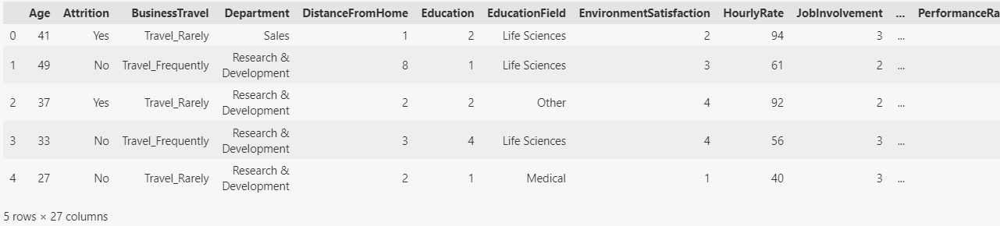
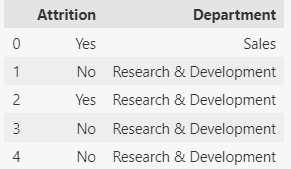
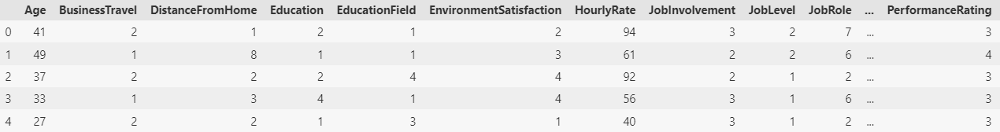
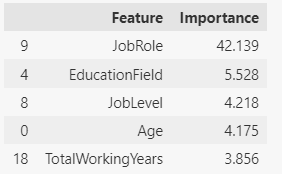
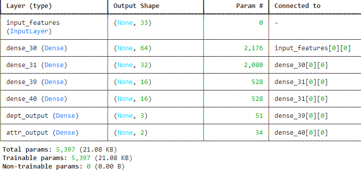

# **Predicting Employee Attrition with Multi-Branch, Neural Network**

Developed a multi-branch, neural network (deep learning) model using TensorFlow's Keras library to predict employee attrition, based on a dataset of employee records. The analysis emphasizes data preprocessing, predictive modeling, and identifying the key factors that drive employee turnover.

[**Project Workflow**](#project-workflow) | [**Data Collection**](#data-collection) | [**Pre-Processing**](#pre-processing) | [**Feature Transformation**](#feature-transformation) | [**Exploratory Data Analysis (EDA)**](#exploratory-data-analysis)

[**Modeling**](#modeling) | [**Model Selection**](#model-selection) | [**Scoring**](#scoring) | [**Evaluate the Model**](#evaluate-the-model)

[**Improving the Model**](#improving-the-model) | [**Follow-On Studies**](#follow-on-studies)

---

## Abstract

This project predicts employee attrition using various machine learning techniques, including deep learning neural networks. After preprocessing the data, including scaling and encoding, models are trained to identify key factors contributing to employee turnover and to predict whether an employee will leave the company.

---

## Core Technologies, Tools

* **Languages/Tools:** Python, Jupyter Notebook, VS Code, Google Colab
* **Libraries:** scikit-learn, pandas, NumPy, TensorFlow, Keras, Matplotlib, Seaborn, SciPy
* **Feature Engineering, EDA:** Hyperparameter Tuning, Cross-Validation, One-Hot Encoding, Ordinal Encoding, Data Scaling, Feature Importance, Correlation Analysis, Evaluation Metrics
* **Models, Algorithms:** Multi-Branch Neural Networks (Deep Learning), Random Forest Classifier

---

## Project Workflow

#### **Data Collection**

* The dataset includes employee data such as department, salary, and attrition status, sourced as a CSV file.

<figure>
    <figcaption><em>fig 1</em></figcaption>
    
</figure>

#### **Pre-Processing**

* Imported the dataset, inspected it, and calculated unique values per column.
* Split the data into target columns (`y_df`) for attrition and department, with features in the `X_df`.

#### **Feature Transformation**

* **Ordinal Encoding:** Applied to categorical columns for the target variables (Attrition and Department, fig 2a) and selected X features (figs 2b, 2c).
* **Pandas one-hot-encoder** `pd.get_dummies()` used to encode remaining X data that was in string format ('JobRole','EducationField','OverTime').
* **Data Scaling:** StandardScaler was applied to ensure all numerical features were on the same scale.

<figure>
    <figcaption><em>fig 2a. y Target data, Pre-Encoding</em></figcaption>
    
</figure>

<figure>
    <figcaption><em>fig 2b. X feature Data, Pre-Encoding</em></figcaption>
    
</figure>

<figure>
    <figcaption><em>fig 2c.  X feature Data, After ordinal encoding</em></figcaption>
    
</figure>

#### **Exploratory Data Analysis (EDA)**

Created visualizations and conducted a correlation analysis to explore relationships between variables and attrition.

* Random Forest Classifier created to capture and investigate **Data Importance** in X Feature data **(figs 3a, 3b).**
* **Correlation Analysis:** Assessed relationships between features to determine variables most correlated with attrition; plotted Correlation Matrix\. **(fig 4).**

<figure>
    <figcaption><em>fig 3a.</em></figcaption>
    
</figure>

<figure>
    <figcaption><em>fig 3b.</em></figcaption>
    
</figure>

```
<figure>
    <figcaption><em>fig 4.</em></figcaption>
    
</figure>
```

---

## Modeling

#### **Model Selection**

* A **Branched Deep Learning Neural Network** was developed using TensorFlow's Keras API.
* The model features shared hidden layers for both attrition and department predictions, branching into two distinct output layers: one for attrition (binary classification) and one for department (multi-class classification).
* Compiled with  **Adam optimizer** , using **categorical_crossentropy** for department classification and **binary_crossentropy** for attrition prediction. Metrics used:  **accuracy** .

```

input_layer = layers.Input(shape=(columns,))
shared_layer1 = layers.Dense(64, activation='relu')(input_layer)
shared_layer2 = layers.Dense(32, activation='relu')(shared_layer1)

# Branch for Attrition
attr_hidden = layers.Dense(16, activation='relu')(shared_layer2)
attr_output = layers.Dense(1, activation='sigmoid', name='attr_output')(attr_hidden)

# Branch for Department
dept_hidden = layers.Dense(16, activation='relu')(shared_layer2)
dept_output = layers.Dense(dept_classes, activation='softmax', name='dept_output')(dept_hidden)

model = Model(inputs=input_layer, outputs=[dept_output, attr_output])

```

<figure>
    <figcaption><em></em></figcaption>
    
</figure>

#### **Training**

The model was trained using 50 epochs and a batch size of 32.

```
history = model.fit(X_train_encoded_scaled, 
                    {'dept_output': y_dept_train_encoded, 'attr_output': y_attr_train_encoded},  
                    validation_data=(X_test_encoded,  
                                    {'dept_output': y_dept_test_encoded, 'attr_output': y_attr_test_encoded}),  
                    epochs=50, batch_size=32)
```

---

## Evaluate the Model

**Evaluation Metrics for Predictions**

* The model performs **well** for Attrition prediction at 81.5%
* The model performs **very well** for Department prediction, with an accuracy of around  **97%** .

```
[1.3614516258239746, 0.8152173757553101, 0.970108687877655]

Total Loss: 1.3614516258239746          	overall error in the model's predictions
Attrition Accuracy: 0.8152173757553101		how often the model correctly predicts Attrition
Department Accuracy: 0.970108687877655 		how often the model correctly predicts Department
```

---

## Improving the Model

* **Hyperparameter Tuning**: try different batch size, epoch number, architecture of neural network (# layers, #
* neurons/layer).
* **Additional Data Enginnering**: dimensionality reduction (PCA), additional investigation of Feature Columns for redundancy.
* **Cross-Validation**: verify model performance is consistent across different slices of the data.
* **Cross-check with predictions from other Model Types** to improve diversity of methods to try to improve overall accuracy.
* **Regularization:** Dropout, L2 regularization, Batch Normalization to prevent overfitting.

---

## Follow-On Studies

* Experiment with additional algorithms like Support Vector Machines (SVM) or Gradient Boosting to improve prediction accuracy.
* Apply advanced feature selection techniques to refine the feature set and improve model interpretability.
* Investigate the impact of external factors like economic conditions on employee attrition rates.
