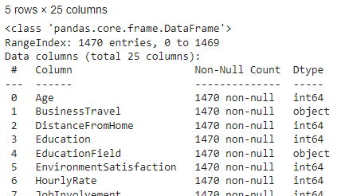
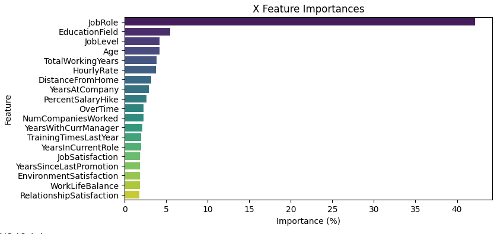
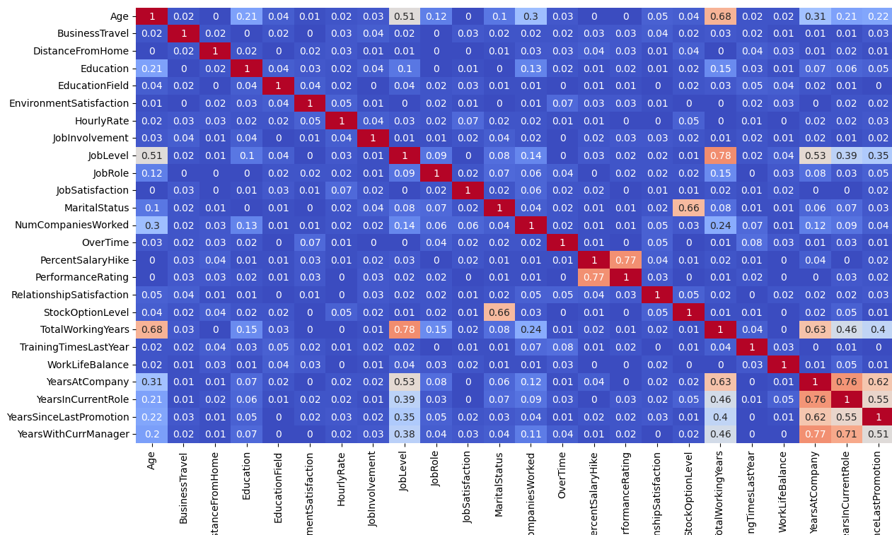
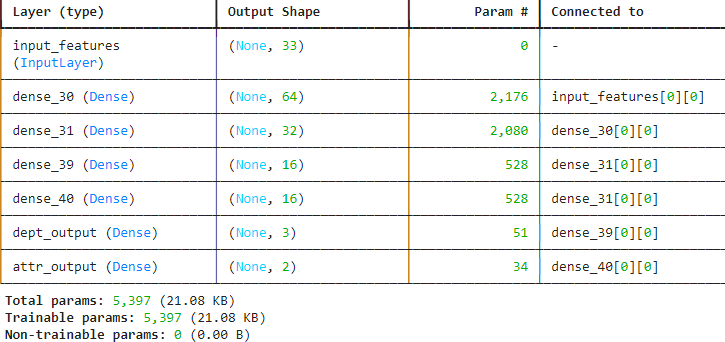

# neural-network-challenge-2

### I. Background

Utlize the employee data to best predict:

* whether employees are likely to leave the company (Attrition) and
* the department that is the best fits each employee (Department)

Employ a Multi-Target / Branched Neural Network.

Datasource:  '[https://static.bc-edx.com/ai/ail-v-1-0/m19/lms/datasets/attrition.csv](https://static.bc-edx.com/ai/ail-v-1-0/m19/lms/datasets/attrition.csv)'

Workbook: **attrition.ipynb**

#### II. Preprocessing

1. Import the data, inspect, determine number of unique values in each column.
2. Split data: create `y_df` with the Attrition and Department columns.
3. Investigate Data Redundancy and Importance in the X data.

   
4. Process the X data that is string data, encode with **Ordinal Encoding**

   
5. Check the data for Feature Importance using **RandomForestClassifier:**
   
6. Visualization of the features using **Seaborn:**



7. Display Feature Correlation Matrix:



10. X_df created by reducting the list of X_data feature columns for any **Feature Importance** value under 1.7%.   No columns removed based on columns being **highly correlated.**
11. y data split into y data for Department predictions and Attrition predictions
12. Data split using train_test_split;
13. `X` data in string format encoded using **Pandas one-hot-encoder** and X_data scaled with **StandardScaler.**

#### III. Create, Compile, and Train the Model

1. Layers created for Multi-Target / Branched model.
2. Shared/common layers created:  input and two shared, hidden layers (Dense layers with Relu activation)
3. Branched to create a distinct hidden and output later for Department and Attrition.
4. Created, compiled the model.  Optimizer='adam', loss for Department set to categorical_crossentropy, loss for Attrition set to binary_crossentropy.  Accuracy selected for metrics.

   
5. Fit/Train the model, using 50 epochs and batch size of 32.
6. Evaluate the model with the TEST?? or TRAINING??  data:  (final training epoch):

```
Epoch 50/50
35/35 ━━━━━━━━━━━━━━━━━━━━ 0s 4ms/step -
attr_output_accuracy: 0.9950 -
dept_output_accuracy: 1.0000 -
loss: 0.0273 -
val_attr_output_accuracy: 0.8397
val_dept_output_accuracy: 0.7120 - val_loss: 30.4962
```

#### IV. Summary

**Model Accuracy:**

```
Total Loss (overall error in the model's predictions): 1.361
Attrition Accuracy (how often the model correctly predicts Attrition): 81.5%
Department Accuracy (how often the model correctly predictsDepartment): 97.0%
```

#### V. Followup, Questions

**Is accuracy the best metric to use on this data?**

* Accuracy should be useful for mulit-class classification ('Department').  However, if the data is imbalanced, Accuracy can be misleading.
* In the case of imbalanced data, it's best to use **precision, recall, F1-score**.  These can give more insights into False Positives and False Negatives,  which will be important to understand in alot of business applications.
* AUC-ROC could also be used.

**Activation functions used for these Neural layers:**

For **Hidden Layers**:

* ReLU (Rectified Linear Unit) is used often with because it performs well
* Helps mitigate the vanishing gradient problem
* Could try Leaky ReLU or ELU (Exponential Linear Unit).

For **Output layers:**

* With Multi-Class classification ('Department'), **softmax** outputs a probability distribution over classes
* For Binary classification ('Attrition'), **sigmoid** is best.

**Improving this model:**

* **Hyperparameter Tuning**: try different batch size, epoch number, architecture of the neural network (# layers, #
  neurons/layer).
* **Additional Data Enginnering**: dimensionality reduction (PCA), additional investigation of Feature Columns for redundancy.
* **Cross-Validation**: verify model performance is consistent across different slices of the data.
* **Cross-check with predictions from other Model Types** to improve diversity of methods to try to improve overall accuracy.
* **Regularization:** Dropout, L2 regularization, Batch Normalization to prevent overfitting.
